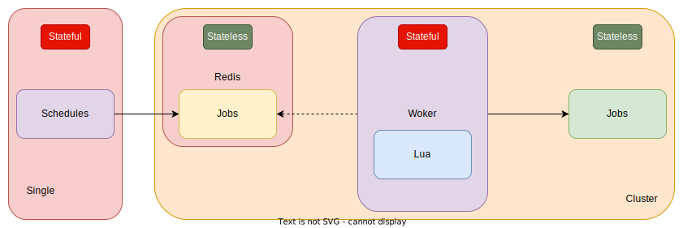

# Schedule

## Architecture design

* The crontab of the schedule only generates events into the queue
* Events can be created manually
* pull into queue events created task, task worker allow parallel
* Events created by tasks are pulled into the queue
* Allowing parallel processing by task workers
* Only task jobs are displayed

